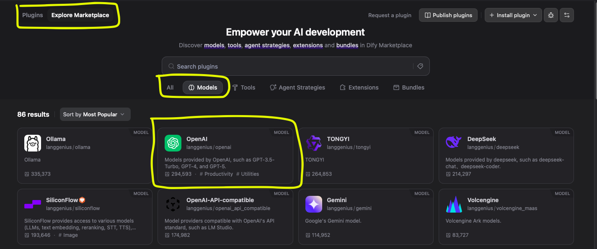
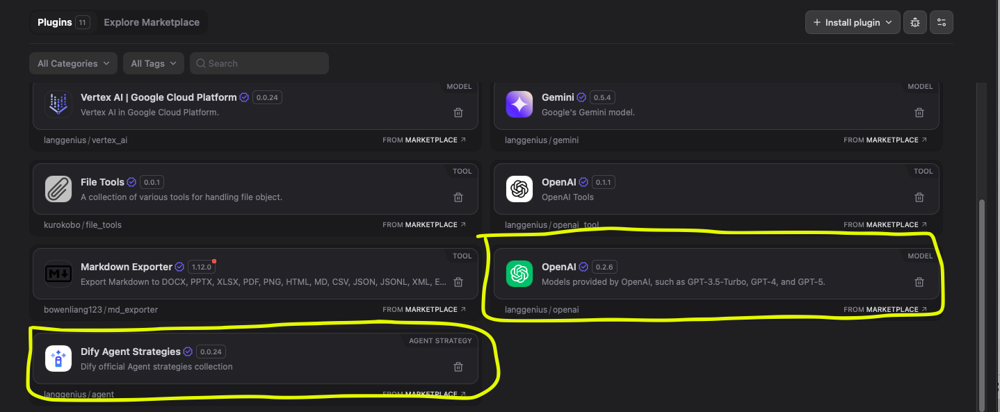
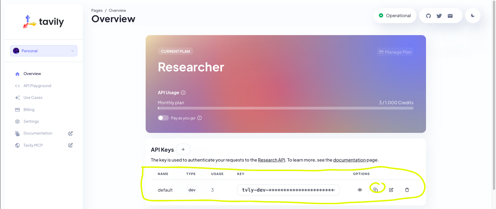
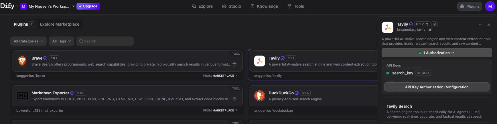
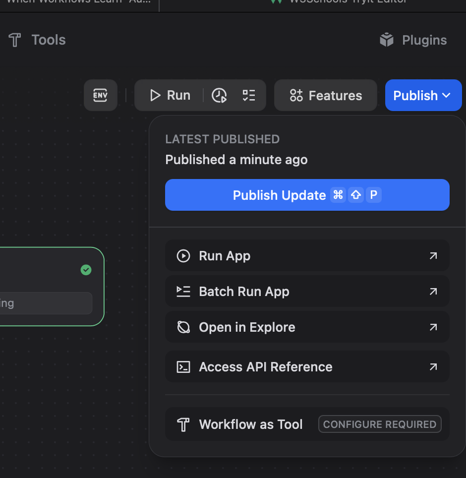

# Tạo DIFY Workflow

Trong phần này, chúng ta truy cập https://cloud.dify.ai/signin và tạo workflow mới

### Bước 1: Upload Dify Workflow bằng file DSL hoặc tạo mới
<place holder image>

---
### Bước 2: Cài đặt các models và tools từ Marketplace
Các App Dify nếu muốn có thêm tính năng, chúng ta có thể cài đặt thêm thư viện được tạo bởi các lập trình viên. Các thư viện này được phân loại theo nhiều mục, ví dụ như Model, Tools, MCP, v..v..

Khi chọn vào **Plugins**  như hình dưới, chúng ta sẽ thấy phần **Marketplaces**

- **Marketplace**: tổng hợp các thư viện được viết sẵn bởi. Chúng ta có thể tìm thấy các thư viện phong phú hơn ở đây. 

- **Plugins**: tổng hợp các thư viện đã được cài đặp từ **Marketplace**. Nếu muốn bỏ thư viện nào khỏi cài đặt, chúng ta vào đây để thao tác.   

#### Bước 2.a: cài đặt `OpenAI` model và `Dify Agent Strategy` từ mục **Marketplace**

- Chọn `Models` -> `OpenAI` -> `Install`  

- Tương tự, chọn `Agent Strategies` -> `Dify Agent Strategy` -> `Install`  

- Sau khi cài đặt, chúng ta có thể nhận thấy các thư viện này đã được thêm vào mục **Plugins**  

#### Bước 2.b: cài đặt các `Tools` khác từ **Marketplace**
Các bạn cài đặt các Tools sau từ **Marketplace**:  
- **DuckDuckGo**: A privacy-focused search engine
- **Wikipedia**: Wikipedia is a free online encyclopedia, created and edited by volunteers around the world
- **Tavily Search**: A powerful AI-native search engine and web content extraction tool that provides highly relevant search results and raw content 

#### Bước 2.c: Setup Tavily Search
Một số các thư viện như Tavily Search đều yêu cầu chúng ta có API Key. Với Tavily Search, chúng ta có thể đăng ký API và credit miễn phí để sử dụng theo các bước:

- Tạo tài khoản Tavily và Đăng nhập vào https://app.tavily.com/home
- Sau khi đăng ký, chúng ta sẽ được đưa đến một giao diện như sau. API Key cũng được tìm thấy ở trang này.
- Nhấn vào nút **copy** được khoanh tròn trong hình để copy

- Quay lại Dify -> Plugin -> Tavily Search. Nhấn vào Authorization, một khung cửa sổ sẽ hiện ra yêu cầu chúng ta nhập thông tin
> Authorization Name: đặt bất cứ tên gì bạn muốn. Ví dụ: tavily_search_key
> Tavily API key: hãy paste Tavily API key chúng ta vừa copy vào đây

**Lưu ý**:
1. Tavily cho chúng ta 1000 credits / tháng để sử dụng. Các bạn có thể xem Credit còn lại trong phần API Usage
2. Mức độ sử dụng Tavily trong workshop này là cho công tác học tập, các project nhỏ.
3. Tìm hiểu thêm về chính sách của Tavily ở đây https://docs.tavily.com/documentation/api-credits 
---
### Bước 3: Tạo một workflow với Agents và chạy thử  
(Cùng thực hành)

---
### Bước 4: Publish workflow  

### Các LƯU Ý khi bắt đầu code với Agent
- Để ý kỹ đến lượng Token sử dụng.
- Bảo vệ kỹ các dữ liệu nhạy cảm như Ngày Tháng Năm Sinh, Số căn cước, Địa chỉ, thông tin ngân hàng, thẻ thanh toán, các thông tin được bảo vệ bởi quy định khác.

### Nguồn tham khảo thêm
 
- Đọc thêm về chính sách bảo mật thư viện của Dify: https://dify.ai/blog/introducing-dify-plugins

- Đọc thêm về Agent của Dify: https://docs.dify.ai/en/guides/workflow/node/agent

- Khám phá các Plugins khác hay ho: `OpenAI Tools`, `Discord`, `ArXiv`, v..v..
---
*Disclaimer: Lưu ý, khi tải các thư viện để tích hợp về dùng, các bạn cần tìm hiểu rõ về các thư viện nói trên và cẩn trọng trong việc sử dụng. Các thư viện được đề cập trong workshop được dùng để phục vụ cho mục đích học tập.*

