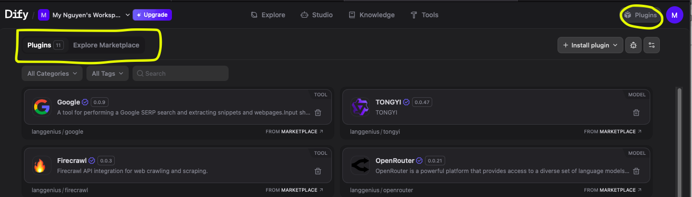

# Tạo DIFY Workflow

Trong phần này, chúng ta truy cập https://cloud.dify.ai/signin và tạo workflow mới

### Bước 1: Upload Dify Workflow bằng file DSL hoặc tạo mới
<place holder image>

---
### Bước 2: Cài đặt các models và tools từ Plugins / Marketplace
Các App Dify nếu muốn có thêm tính năng, chúng ta có thể cài đặt thêm thư viện được tạo bởi các lập trình viên. Các thư viện này được phân loại theo nhiều mục, ví dụ như Model, Tools, MCP, v..v..

Khi chọn vào **Plugins**  như hình dưới, chúng ta sẽ thấy các thư viện này được gộp ở mục **Plugins** hoặc **Marketplaces**

- **Plugins**: tổng hợp các thư viện được viết bởi tác giả của Dify (langgenius). Ở đây chúng ta sẽ tìm được các Model phổ biến như OpenAI hoặc Gemini, và ReAct strategy cho Agent  
- **Marketplace**: tổng hợp các thư viện được viết bởi các tác giả bên thứ 3. Chúng ta có thể tìm thấy các thư viện phong phú hơn ở đây.  

#### Bước 2.a: cài đặt `OpenAI` model và `Dify Agent Strategy` từ mục **Plugins**

  
#### Bước 2.b: cài đặt các `Tools` khác từ **Marketplace**

---
### Bước 3: Tạo một workflow với Agents và chạy thử  

---
### Bước 4: Publish workflow  

