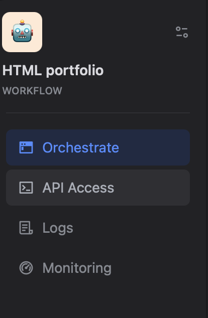
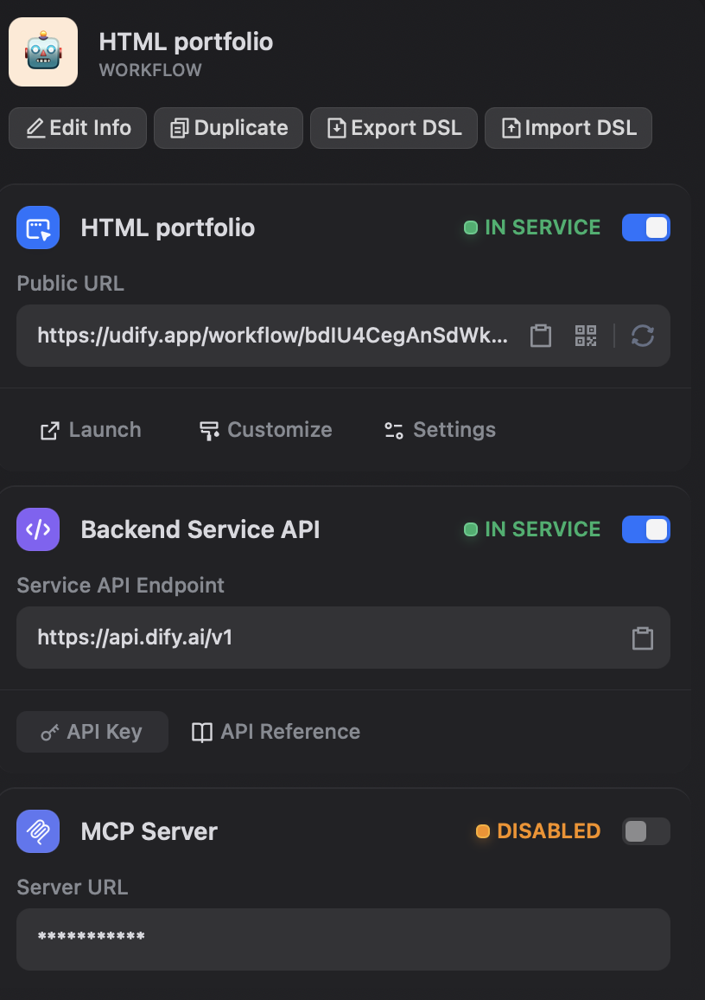

# Gọi DIFY Workflow từ App

Trong phần này, chúng ta tìm hiểu cách gọi DIFY Workflow từ App

### Bước 1: lấy API key

Mở `Setting` của workflow trong Dify



  

### Bước 2: tạo 1 file `.env`  

### Bước 3: set biến DIFY_API_KEY trong `.env`

```
DIFY_API_KEY=thay API key
```

### Bước 4: Chỉnh sửa Payload  
Để gửi yêu cầu (request) đến Dify để xử lý, chúng ta cần gửi đúng cấu trúc của REST API như sau

```bash
curl -X POST 'https://api.dify.ai/v1/workflows/run' \
--header 'Authorization: Bearer {api_key}' \
--header 'Content-Type: application/json' \
--data-raw '{
  "inputs": {},
  "response_mode": "streaming",
  "user": "abc-123"
}'
```

Trong Python, Chúng ta sẽ dùng thư viện `request` để giúp chúng ta soạn đúng cấu trúc trên và gửi đi

- GET: dùng `requests.get()` để soạn
- POST: dùng `requests.post()` để soạn

```python
requests.post(url, headers=headers, json=payload, timeout=(15, HTTP_TIMEOUT))
```

việc của chúng ta là điền vào các arguments

- url
- headers
- json

Paste đoạn code sau vào `...` tương ứng 

```python
headers = {
        "Authorization": f"Bearer {os.getenv("DIFY_API_KEY")}",
        "Content-Type": "application/json",
    }
url = f"https://api.dify.ai/v1/workflows/run"
payload = {
    "inputs": inputs,
    "response_mode": "blocking",
    "user": user_id or "anonymous"
}
```

Ở Dify, chúng ta có thể tìm được hầu hết các chỉ dẫn sử dụng API của họ trong **Documentation**

#### Nguồn  
Học thêm về API:

Học thêm về Streamlit:

Dify API Docs: https://docs.dify.ai/api-reference/workflow-execution/execute-workflow  

